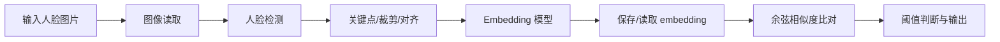

# 人脸识别系统复刻项目计划

## Goal

基于远程服务器跑通成熟开源人脸识别模型，复刻一套“人脸检测 → 特征提取 → embedding 输出 → 相似度比对”的最小可用人脸识别 baseline，并将该模型作为后续系统的预训练/特征提取基础。

## Current Phase

Phase 4 已完成；Phase 5 网页方案暂停。远程服务器已更换 IP 并通过 SSH、环境、项目文件和单图推理恢复验收。当前恢复 Phase 6：核心代码理解、工程整理与统一命令入口。

## Scope

### 当前阶段目标

- 通过 SSH 登录远程服务器 `49.232.174.36:2006`，用户 `cx`。
- 检查服务器 OS、CPU、内存、磁盘、GPU/CUDA、Python 环境。
- 优先使用 InsightFace/ArcFace 成熟预训练模型跑通人脸检测与 embedding 提取。
- 准备一个可重复运行的 demo 脚本：输入图片，输出检测框、关键点、embedding 维度、相似度。
- 暂时不实现猫脸识别、向量数据库和完整业务系统，先拿到稳定的人脸识别 baseline。

### 非目标或后置目标

- 暂不实现猫脸识别训练。
- 暂不部署向量数据库。
- 暂不实现完整 Web/API 服务。
- 暂不处理人脸活体检测、防伪攻击、权限管理等生产级能力。

## Phases

### Phase 1: 需求澄清与技术路线规划

- [x] 明确系统目标：先跑通成熟开源人脸识别模型，作为后续预训练/特征提取 baseline。
- [x] 初步调研开源模型、向量数据库与猫脸数据集路线。
- [x] 形成阶段化技术方案与里程碑。
- [x] 创建 `task_plan.md`、`findings.md`、`progress.md` 作为持久规划文件。
- **Status:** complete

### Phase 2: 远程服务器环境检查与人脸模型 baseline 跑通

- [x] SSH 登录远程服务器，检查基础环境。
- [x] 确认 NVIDIA GPU、系统版本、磁盘与 Python 版本。
- [x] 创建远程工作环境 `face310`。
- [x] 安装 Python 虚拟环境和依赖：`insightface`、`onnxruntime`、`opencv-python-headless`、`numpy` 等。
- [x] 验证依赖可导入，确认推理 provider 情况。
- [x] 编写最小 demo：读取图片，检测人脸并输出 embedding 相关信息。
- [x] 下载/自动拉取 InsightFace 预训练模型并运行真实图片 smoke test。
- [x] 若 GPU 推理失败，先用 CPU 版 baseline 跑通并记录原因。
- **Status:** complete

### Phase 3: 人脸识别相似度验证

- [x] 选择人脸 baseline：优先 `InsightFace`，检测器可用 RetinaFace/SCRFD，识别模型使用 ArcFace 系列 embedding。
- [x] 准备至少两张同一人图片和一张不同人图片。
- [x] 输出同人/不同人余弦相似度。
- [x] 给出初步阈值建议和模型输出说明。
- [x] 增加 `--threshold` 并输出同人/不同人判断。
- [x] 实现最小登记脚本 `scripts/register_person.py`。
- [x] 实现桌面照片同步整理脚本 `scripts/sync_face_dataset.py`。
- **Status:** complete

### Phase 4: 交付与后续扩展建议

- [x] 保存远程运行脚本和依赖清单。
- [x] 记录服务器环境、模型名称、embedding 维度、运行方式。
- [x] 实现最小识别脚本 `scripts/recognize_person.py`。
- [x] 基于 `data/face_test_by_person/` 做批量登记与批量识别评估。
- [x] 检查困难样本，确认强侧脸、低头、遮挡和躺姿是当前主要失败原因。
- [x] 固化推荐评估参数：`--enroll-count 3 --threshold 0.50 --exclude test --min-images 2`。
- [x] 确认网页和向量数据库都不是当前核心，先回到核心代码理解与命令行工具整理。
- **Status:** complete

### Phase 5: 可操作的登记与识别网页

- [x] 创建简单网页和后端服务。
- [x] 支持输入姓名并上传照片进行登记。
- [x] 支持上传照片进行识别，显示姓名与相似度。
- [x] 对无人脸、多人脸和低质量照片提示重拍。
- [x] 在远程服务器启动服务并完成 HTTP 页面测试。
- [ ] 用真实人员照片完成一次网页登记和一次网页识别。
- **Status:** paused

说明：网页只是操作界面，不是人脸识别核心。当前不把网页作为项目必需成果。

### Phase 6: 核心代码理解与一条命令运行

- [ ] 读懂 `face_demo.py` 的输入、处理、输出和程序入口（可本地进行）。
- [ ] 读懂登记和识别数据流：`registry.json`、`embeddings.npy`、余弦相似度与阈值。
- [x] 整理统一命令入口，集中 demo/登记/识别/评估；2026-09-04 远程单图验收通过。仍需激活 `face310`，自动环境选择未实现。
- [x] 增加 `recognize.sh` 一条命令识别入口，自动激活 `face310`；本地静态/失败路径与 23 项回归通过，服务器文件哈希一致并用独立照片完成真实模型验收。
- [x] 将登记流程升级为一次支持多张照片，并明确照片质量规则：本地 10 项回归通过；2026-09-04 三文件哈希一致，远程隔离库完成两照片登记、双人照片拒绝、已登记照片回查、陌生样例拒识，以及全部拒绝时 JSON 哈希/人员数量不变验收。不是独立准确率评估。
- [x] 修正脚本对当前工作目录和相对路径的依赖：本地 14 项测试、编译和从 `/tmp` 查看四脚本帮助通过；服务器 6 文件哈希一致，并从 `/tmp` 直接运行 recognize_person.py 完成真实模型/隔离登记库拒识验收。
- [x] 用独立的已知人员和陌生人员数据重新评估阈值：真实模型完成 53 张已知查询和 2 张确认陌生查询；样本扫描最优 0.34，但因陌生样本过少，不下调默认 0.50。
- **Status:** in_progress

### Phase 6A: 服务器不可用期间的本地推进

- [ ] 完成 Python 基础学习：变量、函数、列表/字典、条件、循环、异常和程序入口。
- [ ] 完成命令行与路径学习：`pwd`、`ls`、`cd`、绝对/相对路径、命令行参数。
- [ ] 按函数阅读 `face_demo.py`，画出输入到输出的数据流。
- [ ] 学会读取 JSON、NumPy 数组和 CSV 评估报告。
- [x] 在不运行模型的前提下整理统一命令、默认路径和 README。
- [ ] 准备服务器恢复清单：确认 SSH、磁盘、Conda 环境、项目文件、模型文件和 GPU provider。
- **Status:** superseded_by_server_recovery

### Phase 7: 猫脸数据集审计与 baseline 准备

- [x] 只读核对 `/home/firecom/yjr/cat_data/cat.tar.gz` 的大小、压缩可读性和成员路径安全性；尚未额外执行整包 SHA-256。
- [x] 利用已有流式去重脚本解压到新的隔离目录，原压缩包未修改或覆盖。
- [x] 统计猫身份数、图片数、每类分布、格式和完全重复；尺寸分布与全量解码损坏检查尚待补充。
- [x] 判断数据是否已裁剪为猫脸，以及是否已有训练/验证/测试划分：数据以猫主体/猫脸近景为主，但没有统一猫脸检测裁剪；已有按身份隔离的 train/validation/test 划分。
- [x] 已确认按身份的 train/validation/test 划分，同一只猫不跨 split。
- [x] 选择 embedding/度量学习路线，并完成 frozen DINOv2 ViT-B/14 validation/test 检索 baseline。
- **Status:** in_progress

## Recommended Architecture



未来扩展时，可以把“保存/读取 embedding”替换为 Qdrant 或 Milvus；这不是当前小规模实验的必需组件。

## Proposed Repository Structure

```text
人脸识别/
  task_plan.md
  findings.md
  progress.md
  README.md
  scripts/
    face_demo.py
    compare_faces.py
    register_person.py
    recognize_person.py
    evaluate_grouped_faces.py
    sync_face_dataset.py
  data/
    samples/
  docs/
    server_env.md
    runbook.md
```

## Key Questions

1. 服务器是否有 NVIDIA GPU？GPU 型号、显存和 CUDA 版本是什么？
2. 服务器是否已有 Conda/Python 环境？
3. 是否允许在用户目录安装 Python 包和下载 InsightFace 预训练模型？
4. 是否已有测试人脸图片？如果没有，先用公开测试图片完成 smoke test。

## Decisions Made

| Decision | Rationale |
|----------|-----------|
| 当前范围收窄为仅跑通人脸识别模型 baseline | 用户已明确“目前仅作人脸识别”，先拿到成熟人脸模型可运行结果。 |
| 人脸 baseline 优先使用 InsightFace/ArcFace | InsightFace 是成熟开源 2D/3D 人脸分析工具箱，包含检测、对齐、识别相关能力，适合复刻 baseline。 |
| 先用 CPU 推理兜底 | 服务器 GPU/CUDA 状态未知，CPU 版 onnxruntime 更容易先跑通；若 GPU 可用再切 onnxruntime-gpu。 |

## Risks

| Risk | Impact | Mitigation |
|------|--------|------------|
| 远程服务器环境不一致 | 安装和训练反复失败 | 优先 Docker/Conda 固化环境；记录 CUDA、驱动、依赖版本 |
| 远程服务器崩溃或数据丢失 | 无法推理、网页不可用、远程产物可能丢失 | 先保留本地代码、数据和报告；恢复后先盘点再重建环境；后续补 Git 和备份 |
| 人脸数据隐私风险 | 合规风险 | 最小化采集、访问控制、加密存储、可删除、用途限定 |

## Milestones

### M0：规划完成

- 产物：`task_plan.md`、`findings.md`、`progress.md`。
- 验收：项目路线、阶段、关键技术选型、风险清楚。

### M1：远程服务器可运行

- 产物：SSH 登录、Python 虚拟环境、GPU/CPU 环境记录、项目目录。
- 验收：远程能运行 Python、PyTorch、模型推理 demo。

### M2：人脸识别 baseline

- 产物：InsightFace demo 脚本、依赖清单、模型运行说明。
- 验收：能够检测图片中的人脸，输出 embedding，并计算两张人脸图的相似度。

## Immediate Next Actions

1. [已完成] 严格单脸模式会排除无脸/多脸查询，并在登记阶段继续扫描直至收集满 N 张有效单脸；服务器最终重跑报告已下载为 `reports/final25.csv` 与 `reports/final25_thresholds.csv`。
2. 学习 `scripts/face_demo.py`，用本地报告 `reports/face_eval_v3.csv` 理解准确率、拒识和检测失败，不把代码升级算作学习完成。
3. [已完成] 用户提供的 25 位、158 张独立陌生人照片已完成格式、检测和误接受评估；141 张为严格单脸有效样本，8 张无脸、9 张多脸，问题清单已保存。
4. 针对 `hb7.jpg`、`zxy5.jpg` 两张检测失败照片学习检测、姿态和质量问题，不用降低识别阈值解决检测失败。
5. 完成一个可验收的本地/服务器命令行 MVP 后，再决定是否恢复网页、引入向量数据库或开始猫脸识别。
6. [已完成] 已完成桌面 `新测试` 9 位、54 张照片的只读质量检查、上传与无泄漏独立严格单脸评测；默认阈值保持 0.50。
7. [已完成] 已备份正式人员库，并将 cx、hb、nx、syy、xzh、yjr、yzh、zr、zxy 正式写入默认 registry；独立新照片回查通过。
8. [已完成] 猫脸数据完成安全审计、按身份拆分、去重冲突清洗和冻结 DINOv2 基线评测；清洗后保留 601,641 张图片、164,100 个身份。
9. [已完成] 使用训练身份的冻结 embedding 完成 2000 步监督式对比学习适配器训练；validation Top-1 59.87%，唯一一次 test Top-1 59.79%，最佳权重与测试报告已落盘。
10. [已完成] validation 公平对照确认多图 gallery 有独立收益：固定样本下 1/2/3 张登记照 Top-1 为 61.36%/71.03%/76.49%；近期 MVP 采用至少 2 张、推荐 3 张登记照。
11. [已完成] validation 错误与身份样本数分层：三图 gallery 下 3,949 个错误涉及 2,880 个身份，已导出 200 个高置信错误路径；7+ 图片身份 Top-1 达 80.43%。
12. [已完成] 已下载并目视核查前 20 个高置信错误联系表；validation 感知哈希审计发现 349 组跨身份近重复候选，前 20 个高置信误认身份对中 10 对被直接命中。
13. [已完成] 仅在 validation 上完成裁剪对照：中心裁剪 Top-1 37.66%，低于原图约 38.73%；猫脸级联检测覆盖率 68.10%，在完全配对的 26,931 个 query 上 Top-1 44.80%，低于原图 46.99%。当前不采用这两种裁剪。
14. [已完成] 349 对候选形成 178 个关联组，已生成不修改原数据的 exclusion/merge-candidate 清单；保守排除 418 个相关身份后，适配器 1/2/3 张登记照 Top-1 分别由 59.87%/70.23%/76.49% 升至 60.16%/70.58%/76.88%。该结果仅为敏感性分析，不代表标签已修正。
15. [已完成] 为适配器加入可选残差旁路和按采样张数过滤身份的安全逻辑；每身份采样 3 张的 2000 步模型在 validation 单图登记达到 Top-1 60.43%、Top-3 70.30%，分别超过旧模型约 0.56/0.28 个百分点。独立重载复核一致，test 未读取。
16. [已完成] 在 SupCon 上加入 Batch-hard Triplet Loss；修正短程筛选与完整训练学习率周期不一致的问题后，权重 0.20 的 2000 步模型在 validation 达到 Top-1 60.59%、Top-3 70.46%。公平 1/2/3 图登记 Top-1 为 62.08%/71.63%/76.99%，test 未读取。
17. [已完成] 将队长 ArcFace V2 放到相同原始 validation 协议复评：1/2 张登记照时 Triplet 更优，3 张时 ArcFace V2 仅微弱领先；test 保持冻结。
18. [进行中] 178 个候选组已按最小 dHash 距离分层；第 133 组完成第一轮目视复核，强烈疑似同猫多 ID，但未改标签。其余 177 组待核。
19. [下一步] 校园 MVP 默认采用 Triplet 模型并优先收集 2～3 张登记照，未知猫阈值另用开放集校准。

## Errors Encountered

| Error | Attempt | Resolution |
|-------|---------|------------|
| 服务器路径升级备份目录随机名字符难辨 | 2 | cp/ls 均仅报目标不存在，无文件改动；改用唯一且限定的 `/home/cx/path-backup-*` 匹配成功，备份包含 5 个旧文件。 |
| 从 `/tmp` 运行 recognize/evaluate `--help` 时本地缺 cv2 | 1 | 将模型依赖移至参数解析后加载；四个底层脚本现在均可在轻量环境从项目外查看帮助。 |
| SFTP 已超时且旧覆盖对话框悬挂 | 取消旧传输后重连 | 2026-09-04 已成功补传登记脚本并完成哈希/真实推理验收；一次旧元素 ID 失效刷新后恢复。 |
| 用户恢复窗口后自动键入无回显、粘贴等待剪贴板超时 | 键入、前台恢复后粘贴 | SSH 提示符可见但自动操作仍不可验明；请用户手动执行只读文件哈希检查回传输出。 |
| 本地 Python 缺 NumPy | 1 | 使用自带依赖运行时进行测试，不修改系统环境。 |
| 测试目录 `/var` / `/private/var` 不一致 | 1 | 测试临时目录 resolve 后 10 项通过。 |
| apply_patch 不允许同一补丁删除并新增同一路径 | 1 | 拆成两个补丁应用，随后编译/测试确认文件完整。 |
| Termius `noWindowsAvailable`，替换界面与状态不一致 | 3 | 重新获取窗口/前台恢复仍失败；保留旧文件备份，暂停同步，远程验收未完成。 |
| 继续后 Termius `AXError.invalidUIElement` 且 AX/截图不一致 | 刷新、切换 SSH、重新前台 | 无法获取 pwd 的可读结果，仍不能确认文件替换；按 planning-with-files 三次失败规则暂停，请用户将已登录服务器终端切至前台。 |
| 系统 SSH 缺少该主机 ED25519 已知密钥 | 1 次只读复核 | 严格校验拒绝连接；未关闭校验或擅自信任网络返回的指纹。 |
| 非交互 SSH 未自动加载 firecom 的 Conda/Python | 1 | 改用 `/home/firecom/miniconda3/...` 绝对路径，不依赖 shell 初始化。 |
| 500 步筛选与历史 500 步节点的余弦学习率周期不同 | 1 | 新增独立 `--scheduler-steps`，用 2000 步周期重新公平筛选；首次结果保留在摘要中但不用于选型。 |
| OpenCV 5.0 Python 包未导出 `CascadeClassifier` | 1 | 读取构建信息确认 Python 绑定缺失；将 transformer 环境固定为兼容的 `opencv-python-headless==4.10.0.84`，接口验证通过。 |
| `stream disconnected before completion` | 1 | 属于对话服务/本地代理连接中断，不是人脸识别项目故障；重新建立会话后继续读取远程结果。 |
| 旧 SSH 会话已被回收 | 1 | 重新登录服务器，只读检查已生成的报告，没有重复运行模型。 |
| `kex_exchange_identification: read: Connection reset by peer` | 3 | 服务器在 SSH 密钥协商前拒绝新连接；暂停重试，待服务器连接限制恢复后用后台服务和 5001 本地隧道继续。 |
| SSH `end of file` / `Connection closed` | 2 种客户端 | 2026-09-03 主机端口已响应，但 SSH 在认证前主动关闭；需在服务器控制台检查 sshd、2006 端口转发和访问控制。 |
| Termius 中统计命令的管道符被自动转义 | 1 | 命令只报参数格式错误、未改动文件；改用已下载的 CSV 在本地完成精确统计。 |
| 复验时误用系统 Python，缺少 NumPy | 1 | 没有安装或改动系统环境；改用 Codex 完整依赖运行时，21 项测试全部通过。 |
| 严格模式丢弃多脸登记照后未补足 enroll-count | 1 次真实评估发现 | 不采用该轮已知率作为最终结论；改为扫描候选直到收集满 N 张有效单脸，再开始查询集。 |
| 批量补丁匹配了不存在的重复报告行 | 1 | 整批补丁被安全拒绝、没有半更新；拆分为小补丁后完成。 |
| Termius 文件列表未自动刷新，且键入会丢下划线 | 1 轮排查 | 用通配符提交命令，并重新载入远程路径；确认 08:22 生成的 `final25` 报告后下载。 |
| 最终复验误用默认 `/opt/miniconda3` Python，且通用运行时也没有 pytest | 2 个环境 | 不安装或改动环境；测试本身基于标准库 `unittest`，改用 `unittest discover`，23 项全部通过。 |
| 首次生成照片联系表时 Python `-c` 的换行转义失效，随后 V8 不提供 base64 辅助函数 | 2 | 未改动原照片；用 `apply_patch` 写入临时脚本后成功生成只读预览联系表。 |
| 首轮独立评测中，部分旧登记候选为多人照，严格模式继续扫描时误将新测试照片用于登记 | 1 | 该轮报告作废；重建 v2 数据集，把所有旧照片置于新照片之前，确保先取得 3 张有效旧照片，新照片只作为查询。 |
| Termius 长命令剪贴板粘贴超时 | 1 | 改用终端输入框直接设值，命令已成功执行。 |
| v2 统计脚本初版使用 `pred_person` 计算较低阈值 | 1 | 已修正统计口径，应使用报告中的 `best_person` 再按阈值重算；0.50 结果不受影响。 |
| 正式批量登记命令与另一服务器任务输入发生拼接 | 1 | 命令在执行前报 Bash 语法错误，人员库未修改；取消残留输入并新建独立 Termius 会话。新会话仍只能输入首字符，暂停写库，避免不完整命令改变正式数据。 |
| Termius 直接键入会丢失下划线、变量符和分号 | 多次 | 不再提交批量 shell 循环；使用不含下划线的通配路径逐人运行短命令，每次等待并核对输出，9 人最终全部成功登记。 |

## Notes

- 这个计划文件是项目“路线图”，后续每完成一个阶段都应更新状态。
- `findings.md` 保存调研依据与技术发现。
- `progress.md` 保存实际执行日志。
